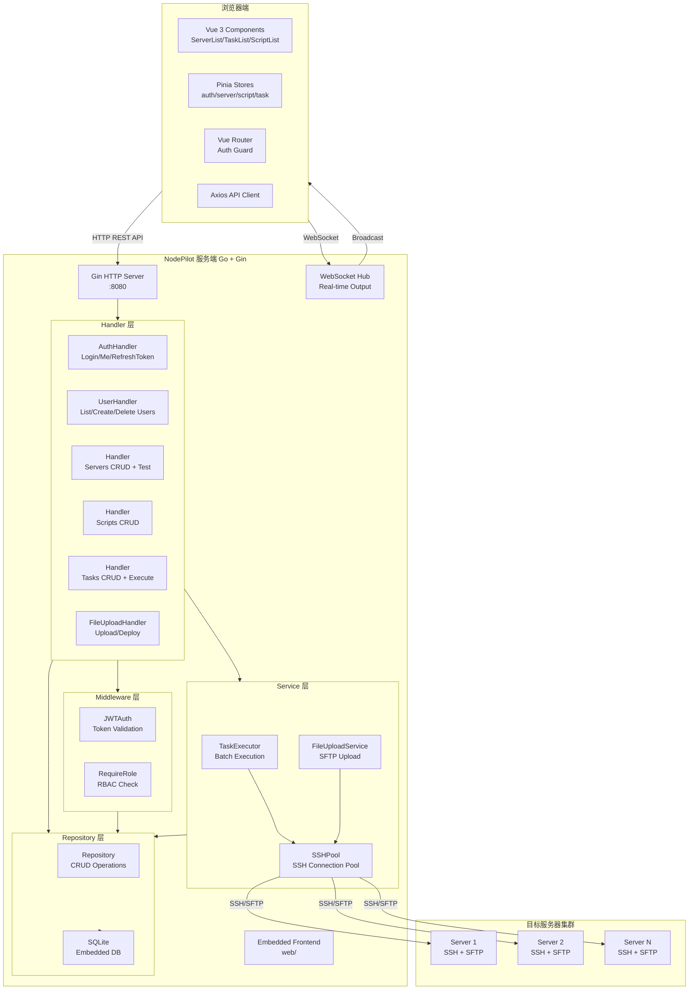
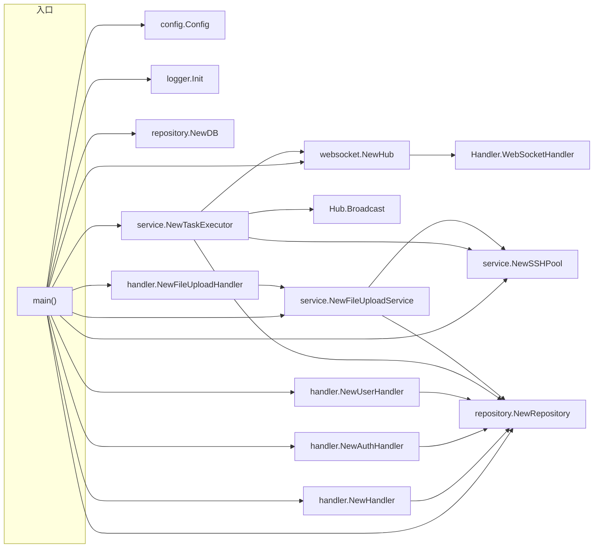
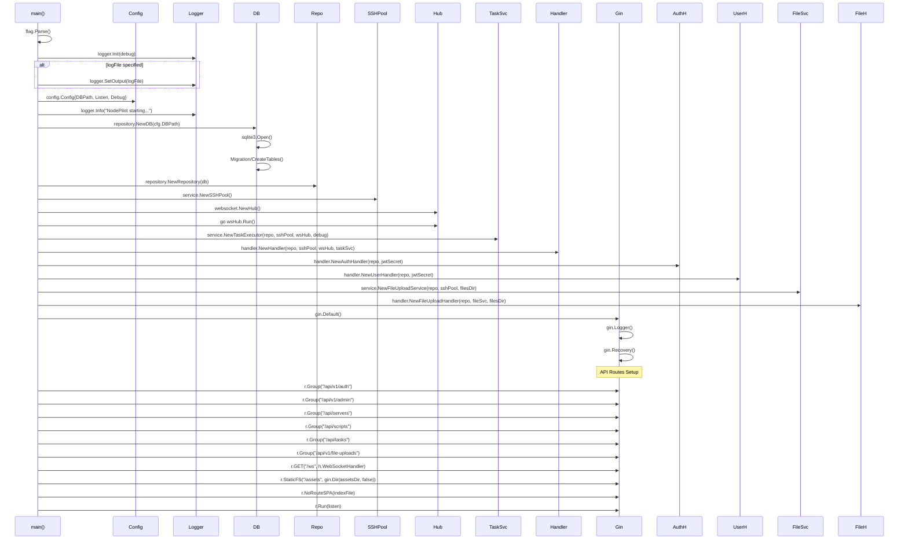
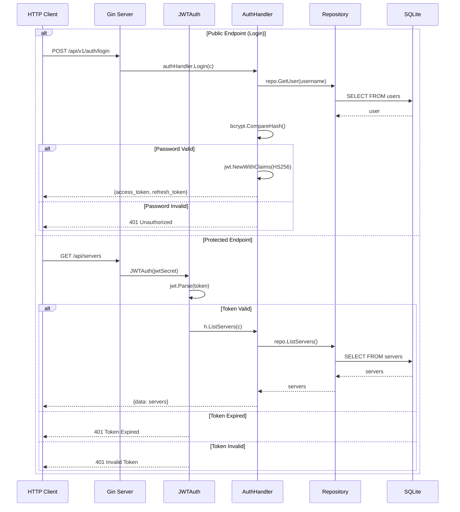
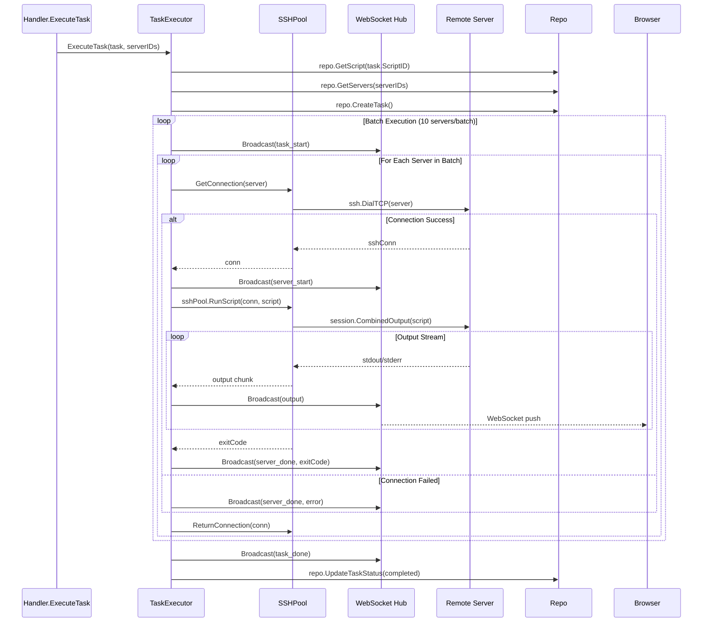
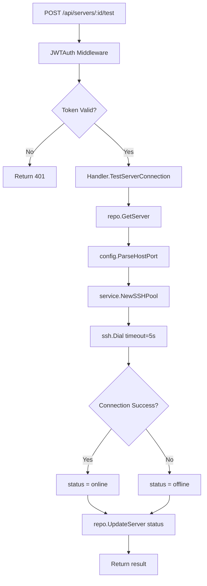
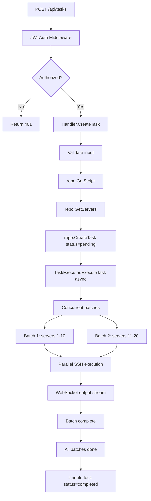
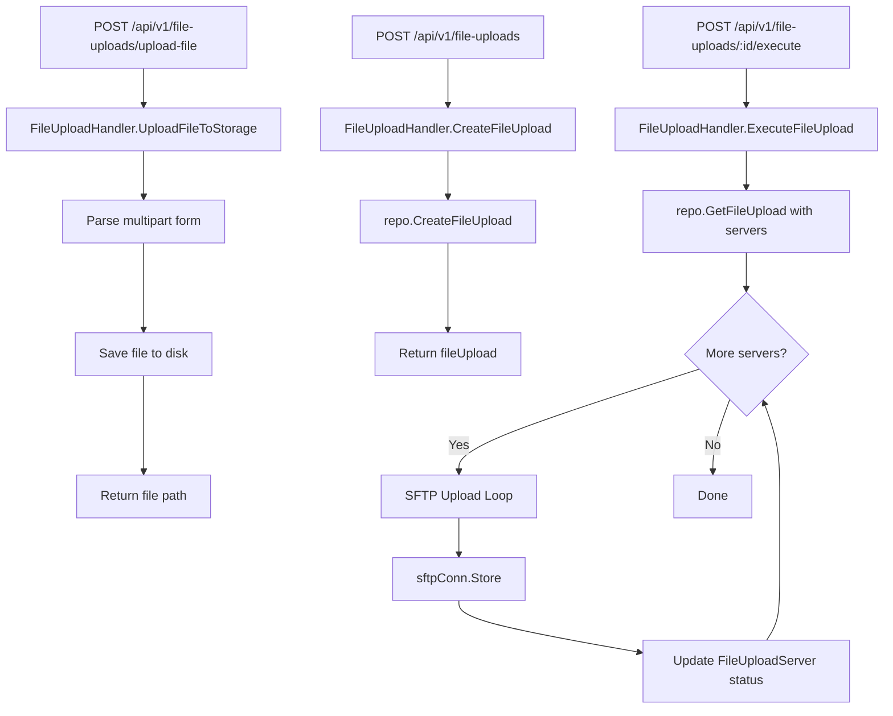
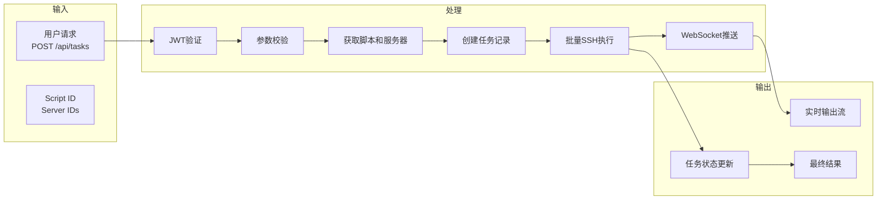

# node-pilot 批量服务器管理平台 - 项目可视化文档

## 项目概述

| 属性 | 值 |
|------|-----|
| **项目名称** | node-pilot |
| **模块路径** | node-pilot |
| **编程语言** | Go + Vue 3 + TypeScript |
| **仓库路径** | /mnt/e/project/opencode-project/goProject/src/test-dev/node-pilot |
| **索引状态** | ✅ 已索引 (367 files, 13009 symbols, 34955 relationships) |
| **架构模式** |前后端分离 + 嵌入式前端 + WebSocket实时通信 |

---

## 外部依赖库

### 直接依赖 (Direct Dependencies)

| 库名 | 版本 | 用途 | 源码路径 |
|------|------|------|----------|
| **github.com/gin-gonic/gin** | v1.12.0 | HTTP Web框架，Gin高性能路由和中间件 | backend |
| **github.com/golang-jwt/jwt/v5** | v5.2.1 | JWT认证，支持Access Token和Refresh Token | backend/internal/auth/jwt.go |
| **github.com/gorilla/websocket** | v1.5.3 | WebSocket支持，实时输出推送 | backend/internal/websocket/hub.go |
| **github.com/mattn/go-sqlite3** | v1.14.38 | SQLite数据库驱动，嵌入式数据库 | backend/internal/repository/db.go |
| **github.com/pkg/sftp** | v1.13.10 | SFTP文件传输协议实现 | backend/internal/service/ssh.go |
| **golang.org/x/crypto** | v0.49.0 | SSH加密通信，密码加密(AES-256-GCM) | backend/internal/service/ssh.go |

### 间接依赖 (Indirect Dependencies)

| 库名 | 版本 | 来源 | 用途 |
|------|------|------|------|
| github.com/bytedance/sonic | v1.15.0 | gin依赖 | JSON序列化 |
| github.com/bytedance/sonic/loader | v0.5.0 | sonic依赖 | 动态加载 |
| github.com/cloudwego/base64x | v0.1.6 | gin依赖 | Base64编解码 |
| github.com/gabriel-vasile/mimetype | v1.4.12 | gin依赖 | MIME类型检测 |
| github.com/gin-contrib/sse | v1.1.0 | gin依赖 | Server-Sent Events |
| github.com/go-playground/locales | v0.14.1 | gin-validator依赖 | 本地化 |
| github.com/go-playground/universal-translator | v0.18.1 | gin-validator依赖 | 翻译器 |
| github.com/go-playground/validator/v10 | v10.30.1 | gin依赖 | 参数验证 |
| github.com/goccy/go-json | v0.10.5 | gin依赖 | 高性能JSON |
| github.com/goccy/go-yaml | v1.19.2 | gin依赖 | YAML解析 |
| github.com/json-iterator/go | v1.1.12 | gin依赖 | 高性能JSON库 |
| github.com/klauspost/cpuid | v2.3.0 | gin依赖 | CORS跨域支持 |
| github.com/kr/fs | v0.1.0 | sftp依赖 | 文件系统操作 |
| github.com/leodido/go-urn | v1.4.0 | gin依赖 | URN解析 |
| github.com/mattn/go-isatty | v0.0.20 | gin依赖 | 终端检测 |
| github.com/modern-go/concurrent | v0.0.0 | json-iterator依赖 | 并发安全 |
| github.com/modern-go/reflect2 | v1.0.2 | json-iterator依赖 | 反射优化 |
| github.com/pelletier/go-toml/v2 | v2.2.4 | gin依赖 | TOML配置 |
| github.com/quic-go/qpack | v0.6.0 | quic-go依赖 | QUIC协议 |
| github.com/quic-go/quic-go | v0.59.0 | gin/quic依赖 | QUIC传输 |
| github.com/twitchyliquid64/golang-asm | v0.15.1 | gin依赖 | 底层优化 |
| github.com/ugorji/go/codec | v1.3.1 | gin依赖 | 编解码器 |
| go.mongodb.org/mongo-driver/v2 | v2.5.0 | quic-go依赖 | Mongo驱动 |
| golang.org/x/arch | v0.22.0 | gin/crypto依赖 | 架构支持 |
| golang.org/x/net | v0.51.0 | gin/crypto/websocket依赖 | 网络库 |
| golang.org/x/sys | v0.42.0 | crypto/sftp依赖 | 系统调用 |
| golang.org/x/text | v0.35.0 | gin依赖 | 文本处理 |
| google.golang.org/protobuf | v1.36.10 | quic-go依赖 | Protocol Buffers |

---

## 项目架构图

### 系统架构图



### 模块依赖关系图



---

## 项目结构

```
node-pilot/
├── backend/
│   ├── cmd/server/
│   │   └── main.go                    # 程序入口，188行
│   ├── internal/
│   │   ├── auth/
│   │   │   └── jwt.go                 # JWT Claims 结构体
│   │   ├── config/
│   │   │   └── config.go              # 配置结构体 Config
│   │   ├── handler/
│   │   │   ├── auth.go                # 认证处理器 AuthHandler
│   │   │   ├── fileupload.go          # 文件上传处理器 FileUploadHandler
│   │   │   ├── handler.go            # 核心Handler (服务器/脚本/任务CRUD)
│   │   │   └── user.go               # 用户管理处理器 UserHandler
│   │   ├── logger/
│   │   │   └── logger.go             # 日志模块 Logger
│   │   ├── middleware/
│   │   │   └── auth.go               # JWT认证中间件 JWTAuth / RequireRole
│   │   ├── model/
│   │   │   └── model.go              # 数据模型: Server/Script/Task/User/WSMessage
│   │   ├── repository/
│   │   │   └── db.go                 # 数据库访问层 Repository / NewDB
│   │   ├── service/
│   │   │   ├── fileupload.go         # 文件上传服务 FileUploadService
│   │   │   ├── ssh.go                # SSH连接池 SSHPool
│   │   │   └── task.go              # 任务执行器 TaskExecutor
│   │   └── websocket/
│   │       └── hub.go               # WebSocket Hub (Client/Hub)
│   └── web/                         # 嵌入式前端静态资源
│       ├── index.html
│       └── assets/                  # Vue构建产物
├── frontend/
│   ├── src/
│   │   ├── api/
│   │   │   └── index.ts             # Axios API封装
│   │   ├── components/
│   │   │   ├── NavBar.vue           # 导航栏
│   │   │   ├── OutputPanel.vue      # 输出面板
│   │   │   └── Pagination.vue       # 分页组件
│   │   ├── router/
│   │   │   ├── auth-guard.ts        # 路由守卫
│   │   │   └── index.ts            # 路由配置 (7个路由)
│   │   ├── stores/
│   │   │   ├── auth.ts             # 认证状态管理
│   │   │   ├── fileupload.ts       # 文件上传状态
│   │   │   ├── script.ts           # 脚本状态
│   │   │   ├── server.ts          # 服务器状态
│   │   │   └── task.ts            # 任务状态
│   │   ├── types/
│   │   │   └── index.ts           # TypeScript接口定义
│   │   ├── views/
│   │   │   ├── FileForm.vue       # 文件表单页
│   │   │   ├── FileList.vue       # 文件列表页
│   │   │   ├── Login.vue          # 登录页
│   │   │   ├── Profile.vue        # 个人资料页
│   │   │   ├── ScriptForm.vue    # 脚本表单页
│   │   │   ├── ScriptList.vue    # 脚本列表页
│   │   │   ├── ServerForm.vue    # 服务器表单页
│   │   │   ├── ServerList.vue    # 服务器列表页
│   │   │   ├── TaskForm.vue      # 任务表单页
│   │   │   ├── TaskList.vue      # 任务列表页
│   │   │   ├── TaskOutput.vue    # 任务输出页
│   │   │   └── UserList.vue     # 用户列表页
│   │   ├── App.vue
│   │   └── main.ts
│   └── package.json
├── docs/                           # 文档和迭代计划
│   ├── plan/                       # 任务计划文档
│   └── review/                    # 代码审查报告
├── data/                          # SQLite数据库目录
├── scripts/
│   └── start.sh                   # 启动脚本
├── README.md
└── AGENTS.md
```

---

## 完整函数调用链路

### main() 启动链路



### API 请求处理链路 (认证流程)



### 任务执行链路 (TaskExecutor + SSH Pool)



---

## 核心模块说明

### Handler 模块 (backend/internal/handler/)

| 结构体/函数 | 文件路径 | 说明 | 核心方法 |
|------------|----------|------|----------|
| **Handler** | handler.go:25 | 核心处理器，管理服务器/脚本/任务 | ListServers, CreateServer, TestServerConnection, ListScripts, CreateScript, ListTasks, CreateTask, ExecuteTask |
| **AuthHandler** | auth.go | 认证处理器 | Login, Me, RefreshToken, UpdateProfile, ChangePassword |
| **UserHandler** | user.go | 用户管理处理器 | ListUsers, CreateUser, DeleteUsers |
| **FileUploadHandler** | fileupload.go | 文件上传处理器 | ListFileUploads, CreateFileUpload, UpdateFileUpload, ExecuteFileUpload, UploadFileToStorage |
| **NewHandler** | handler.go:41 | Handler构造函数 | - |
| **NewAuthHandler** | auth.go | AuthHandler构造函数 | - |
| **NewUserHandler** | user.go | UserHandler构造函数 | - |
| **NewFileUploadHandler** | fileupload.go | FileUploadHandler构造函数 | - |

### Service 模块 (backend/internal/service/)

| 结构体/函数 | 文件路径 | 说明 | 核心方法 |
|------------|----------|------|----------|
| **TaskExecutor** | task.go:21 | 任务执行器，支持批量并发 | ExecuteTask, CancelTask, GetTaskOutput |
| **SSHPool** | ssh.go:12 | SSH连接池，管理远程连接 | GetConnection, RunScript, DeployFile, ReturnConnection |
| **FileUploadService** | fileupload.go | 文件上传服务 | CreateFileUpload, ExecuteFileUpload |
| **streamingWriter** | task.go:21 | 任务输出流写入器 | Write, Close |
| **outputWriter** | task.go:21 | 输出写入器 | Write, Close |
| **NewTaskExecutor** | task.go | TaskExecutor构造函数 | - |
| **NewSSHPool** | ssh.go | SSHPool构造函数 | - |
| **NewFileUploadService** | fileupload.go | FileUploadService构造函数 | - |

### Repository 模块 (backend/internal/repository/)

| 结构体/函数 | 文件路径 | 说明 | 核心方法 |
|------------|----------|------|----------|
| **Repository** | db.go:14 | 数据库访问层 | ListServers, GetServer, CreateServer, DeleteServer, ListScripts, CreateScript, ListTasks, CreateTask, UpdateTask, GetTaskOutput |
| **NewRepository** | db.go | Repository构造函数 | - |
| **NewDB** | db.go | 数据库初始化，创建表结构 | - |

### WebSocket 模块 (backend/internal/websocket/)

| 结构体/函数 | 文件路径 | 说明 | 核心方法 |
|------------|----------|------|----------|
| **Hub** | hub.go:27 | WebSocket Hub，管理所有连接 | Run, Register, Unregister, Broadcast |
| **Client** | hub.go | 单个WebSocket客户端 | Send, ReadPump, WritePump |
| **NewHub** | hub.go | Hub构造函数 | - |

### Middleware 模块 (backend/internal/middleware/)

| 函数 | 文件路径 | 说明 |
|------|----------|------|
| **JWTAuth** | auth.go | JWT认证中间件，验证Token有效性 |
| **RequireRole** | auth.go | 角色检查中间件，RBAC权限控制 |

### Model 模块 (backend/internal/model/)

| 结构体 | 文件 | 字段 |
|--------|------|------|
| **Server** | model.go | Id, Name, Host, Port, Username, PasswordEncrypted, ConnectionStatus, CreatedAt, UpdatedAt |
| **Script** | model.go | Id, Name, Description, Content, TargetPath, CreatedAt, UpdatedAt |
| **Task** | model.go | Id, ScriptId, Name, Status, CreatedAt, StartedAt, FinishedAt |
| **TaskServer** | model.go | TaskId, ServerId, Status, Output, ExitCode |
| **User** | model.go | Id, Username, PasswordHash, Role, CreatedAt |
| **FileUpload** | model.go | Id, Name, FilePath, Servers, Status |
| **FileUploadServer** | model.go | FileUploadId, ServerId, Status, Result |
| **WSMessage** | model.go | Type, TaskId, ServerId, ServerName, Content, Status, ExitCode, Timestamp |

---

## 关键执行流程

### 1. 服务器连接测试流程



### 2. 批量任务执行流程



### 3. 文件上传部署流程



---

## API 路由汇总

### 认证路由 `/api/v1/auth`

| 方法 | 路径 | 处理函数 | 认证 | 说明 |
|------|------|----------|------|------|
| POST | /login | authHandler.Login | ❌ | 用户登录 |
| GET | /me | authHandler.Me | ✅ | 获取当前用户信息 |
| POST | /refresh | authHandler.RefreshToken | ❌ | 刷新Token |
| PUT | /profile | authHandler.UpdateProfile | ✅ | 更新个人信息 |
| PUT | /password | authHandler.ChangePassword | ✅ | 修改密码 |

### 用户管理路由 `/api/v1/admin`

| 方法 | 路径 | 处理函数 | 认证 | 说明 |
|------|------|----------|------|------|
| GET | /users | userHandler.ListUsers | ✅ + ADMIN | 获取用户列表 |
| POST | /users | userHandler.CreateUser | ✅ + ADMIN | 创建用户 |
| DELETE | /users/:id | userHandler.DeleteUsers | ✅ + ADMIN | 删除用户 |
| POST | /users/batch-delete | userHandler.DeleteUsers | ✅ + ADMIN | 批量删除用户 |

### 服务器路由 `/api/servers`

| 方法 | 路径 | 处理函数 | 分页 | 说明 |
|------|------|----------|------|------|
| GET | | h.ListServers | ✅ | 获取服务器列表 |
| GET | /:id | h.GetServer | | 获取服务器详情 |
| POST | | h.CreateServer | | 创建服务器 |
| PUT | /:id | h.UpdateServer | | 更新服务器 |
| DELETE | /:id | h.DeleteServer | | 删除服务器 |
| POST | /:id/test | h.TestServerConnection | | 测试连接 |
| POST | /batch-delete | h.DeleteServers | | 批量删除 |

### 脚本路由 `/api/scripts`

| 方法 | 路径 | 处理函数 | 分页 | 说明 |
|------|------|----------|------|------|
| GET | | h.ListScripts | ✅ | 获取脚本列表 |
| GET | /:id | h.GetScript | | 获取脚本详情 |
| POST | | h.CreateScript | | 创建脚本 |
| PUT | /:id | h.UpdateScript | | 更新脚本 |
| DELETE | /:id | h.DeleteScript | | 删除脚本 |
| POST | /batch-delete | h.DeleteScripts | | 批量删除 |

### 任务路由 `/api/tasks`

| 方法 | 路径 | 处理函数 | 分页 | 说明 |
|------|------|----------|------|------|
| GET | | h.ListTasks | ✅ | 获取任务列表 |
| GET | /:id | h.GetTask | | 获取任务详情 |
| POST | | h.CreateTask | | 创建任务 |
| PUT | /:id | h.UpdateTask | | 更新任务 |
| POST | /:id/execute | h.ExecuteTask | | 执行任务 |
| DELETE | /:id | h.CancelTask | | 取消任务 |
| POST | /batch-delete | h.DeleteTasks | | 批量删除 |
| GET | /:id/output | h.GetTaskOutput | | 获取任务输出(SSE) |

### 文件上传路由 `/api/v1/file-uploads`

| 方法 | 路径 | 处理函数 | 说明 |
|------|------|----------|------|
| GET | | fileUploadHandler.ListFileUploads | 文件上传列表 |
| POST | | fileUploadHandler.CreateFileUpload | 创建文件上传记录 |
| PUT | /:id | fileUploadHandler.UpdateFileUpload | 更新文件上传记录 |
| DELETE | | fileUploadHandler.DeleteFileUploads | 删除文件上传记录 |
| POST | /:id/execute | fileUploadHandler.ExecuteFileUpload | 执行文件部署 |
| GET | /:id/results | fileUploadHandler.GetFileUploadResults | 获取部署结果 |

### 其他路由

| 方法 | 路径 | 处理函数 | 说明 |
|------|------|----------|------|
| POST | /api/upload | h.UploadFile | 上传文件 |
| POST | /api/deploy | h.DeployFile | 部署文件 |
| GET | /ws | h.WebSocketHandler | WebSocket连接 |

---

## GitNexus 查询提示

### 按模块查询

| 模块 | GitNexus Query |
|------|----------------|
| Handler模块 | `gitnexus_query("Handler CRUD servers scripts tasks API", repo="node-pilot")` |
| Service模块 | `gitnexus_query("Service SSH task executor fileupload batch", repo="node-pilot")` |
| Repository模块 | `gitnexus_query("Repository database SQLite CRUD operations", repo="node-pilot")` |
| WebSocket模块 | `gitnexus_query("WebSocket Hub broadcast real-time output", repo="node-pilot")` |
| Auth模块 | `gitnexus_query("JWT authentication middleware token validation", repo="node-pilot")` |
| SSHPool模块 | `gitnexus_query("SSH connection pool remote server management", repo="node-pilot")` |

### 按函数名精确查询

| 函数名 | GitNexus Context |
|--------|------------------|
| main入口 | `gitnexus_context(name="main", repo="node-pilot")` |
| Handler创建 | `gitnexus_context(name="NewHandler", repo="node-pilot")` |
| 任务执行 | `gitnexus_context(name="ExecuteTask", repo="node-pilot")` |
| 连接测试 | `gitnexus_context(name="TestServerConnection", repo="node-pilot")` |
| JWT中间件 | `gitnexus_context(name="JWTAuth", repo="node-pilot")` |
| WebSocket Hub | `gitnexus_context(name="NewHub", repo="node-pilot")` |
| 脚本运行 | `gitnexus_context(name="RunScript", repo="node-pilot")` |
| 文件部署 | `gitnexus_context(name="DeployFile", repo="node-pilot")` |
| 用户登录 | `gitnexus_context(name="Login", repo="node-pilot")` |
| Token刷新 | `gitnexus_context(name="RefreshToken", repo="node-pilot")` |

### 完整调用链查询

```cypher
-- 查看main函数调用的所有函数
gitnexus_cypher("MATCH (main:Function {name: 'main'})-[:CALLS]->(f) RETURN main.name, f.name, f.filePath", repo="node-pilot")

-- 查看TaskExecutor相关函数
gitnexus_cypher("MATCH (f:Function) WHERE f.name CONTAINS 'Task' RETURN f.name, f.filePath", repo="node-pilot")

-- 查看Handler所有HTTP方法
gitnexus_cypher("MATCH (f:Function) WHERE f.name CONTAINS 'Handler' RETURN f.name, f.filePath", repo="node-pilot")

-- 查看Service层函数
gitnexus_cypher("MATCH (f:Function) WHERE f.name CONTAINS 'Service' OR f.name CONTAINS 'Pool' RETURN f.name, f.filePath", repo="node-pilot")
```

### 前端组件查询

| 组件 | 查询方式 |
|------|----------|
| 服务器列表 | `gitnexus_context(name="ServerList", repo="node-pilot")` |
| 脚本列表 | `gitnexus_context(name="ScriptList", repo="node-pilot")` |
| 任务列表 | `gitnexus_context(name="TaskList", repo="node-pilot")` |
| 登录页 | `gitnexus_context(name="Login", repo="node-pilot")` |
| 服务器Store | `gitnexus_context(name="useServerStore", repo="node-pilot")` |
| 任务Store | `gitnexus_context(name="useTaskStore", repo="node-pilot")` |
| 认证Store | `gitnexus_context(name="useAuthStore", repo="node-pilot")` |

---

## 关键常量与配置

### JWT配置

| 常量 | 值 | 说明 |
|------|-----|------|
| JWT_SECRET | "node-pilot-jwt-secret-key-32bytes!" | JWT签名密钥 (32字节 for HS256) |
| ACCESS_TOKEN_EXPIRY | 24小时 | Access Token有效期 |
| REFRESH_TOKEN_EXPIRY | 7天 | Refresh Token有效期 |

### 服务配置

| 配置项 | 默认值 | 命令行参数 | 说明 |
|--------|--------|------------|------|
| 监听地址 | :8080 | --listen | HTTP服务监听地址 |
| 数据库路径 | ./data/servers.db | --db | SQLite数据库文件路径 |
| 调试模式 | false | --debug | 启用调试日志 |
| 日志文件 | stdout | --log | 日志输出文件 |
| 文件存储目录 | <db_dir>/files | --files | 上传文件存储目录 |

### 权限角色

| 角色 | 说明 | 权限 |
|------|------|------|
| ROLE_ADMIN | 管理员 | 所有API权限 + 用户管理 |
| ROLE_USER | 普通用户 | 个人数据操作 |

---

## 数据流图

### 任务执行完整数据流


