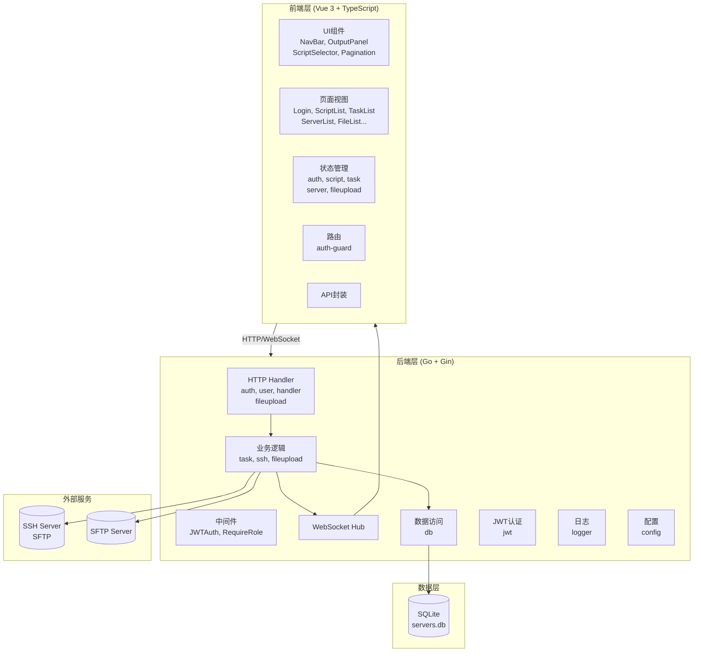
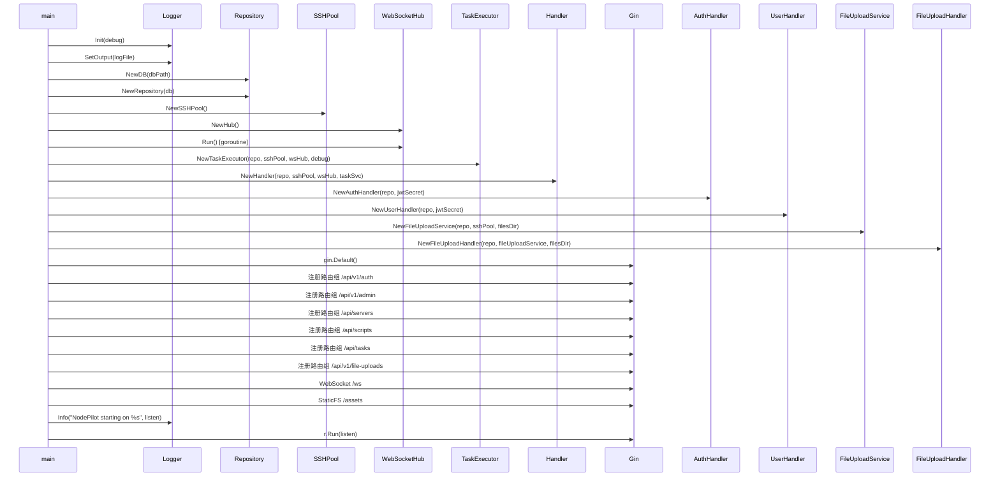
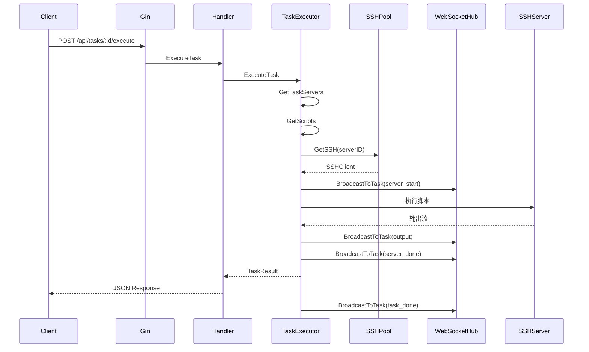
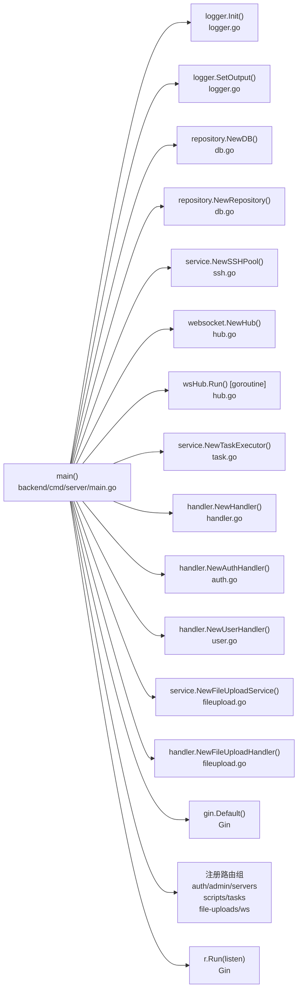
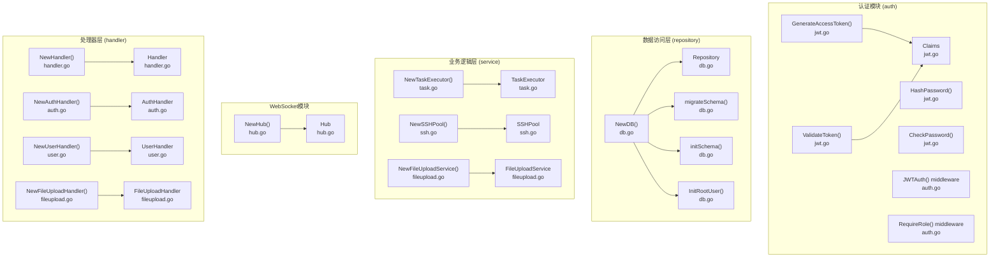
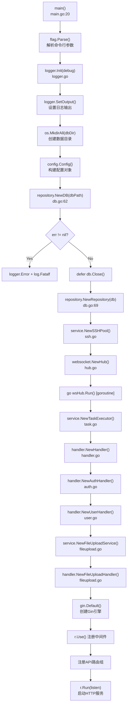
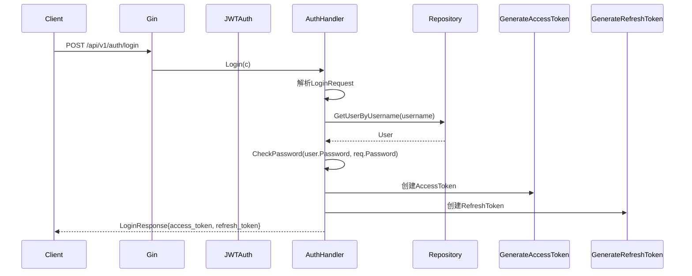
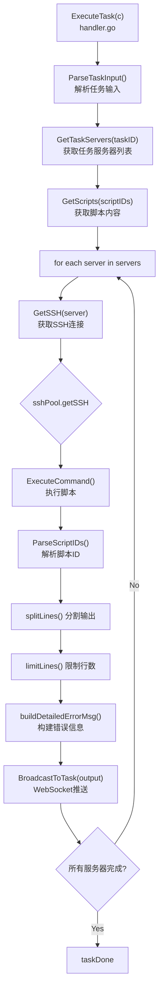

# node-pilot

## 项目概述

| 属性 | 值 |
|------|-----|
| 项目名称 | node-pilot |
| 模块路径 | node-pilot |
| 编程语言 | Go + Vue 3 + TypeScript |
| 仓库路径 | /mnt/e/project/opencode-project/goProject/src/test-dev/node-pilot |
| 项目类型 | 批量服务器管理平台 |
| Go版本 | 1.25.7 |
| 功能简介 | 一键部署、批量操作、实时监控的服务器批量管理平台 |

## 项目架构图



## 项目结构

```
node-pilot/
├── backend/
│   ├── cmd/server/
│   │   └── main.go                 # 程序入口
│   ├── internal/
│   │   ├── auth/
│   │   │   └── jwt.go              # JWT认证
│   │   ├── config/
│   │   │   └── config.go           # 配置管理
│   │   ├── handler/
│   │   │   ├── auth.go             # 认证处理器
│   │   │   ├── user.go             # 用户管理处理器
│   │   │   ├── fileupload.go        # 文件上传处理器
│   │   │   └── handler.go           # 通用处理器
│   │   ├── middleware/
│   │   │   └── auth.go             # JWT认证中间件
│   │   ├── model/
│   │   │   └── model.go            # 数据模型
│   │   ├── repository/
│   │   │   └── db.go               # 数据库操作
│   │   ├── service/
│   │   │   ├── task.go             # 任务执行器
│   │   │   ├── ssh.go              # SSH连接池
│   │   │   └── fileupload.go       # 文件上传服务
│   │   ├── websocket/
│   │   │   └── hub.go              # WebSocket Hub
│   │   └── logger/
│   │       └── logger.go           # 日志管理
│   ├── go.mod
│   └── data/                        # SQLite数据库目录
├── frontend/
│   ├── index.html
│   ├── package.json
│   ├── tsconfig.json
│   ├── tsconfig.node.json
│   ├── vite.config.ts
│   └── src/
│       ├── main.ts
│       ├── App.vue
│       ├── api/
│       │   └── index.ts            # API封装
│       ├── components/
│       │   ├── NavBar.vue
│       │   ├── OutputPanel.vue
│       │   ├── Pagination.vue
│       │   ├── ScriptSelector.vue
│       │   ├── FileForm.vue
│       │   ├── FileList.vue
│       │   ├── Login.vue
│       │   ├── Profile.vue
│       │   ├── ScriptForm.vue
│       │   ├── ScriptList.vue
│       │   ├── ServerForm.vue
│       │   ├── ServerList.vue
│       │   ├── TaskDetail.vue
│       │   ├── TaskForm.vue
│       │   ├── TaskList.vue
│       │   ├── TaskOutput.vue
│       │   └── UserList.vue
│       ├── router/
│       │   ├── index.ts
│       │   └── auth-guard.ts
│       ├── stores/
│       │   ├── auth.ts
│       │   ├── script.ts
│       │   ├── task.ts
│       │   ├── server.ts
│       │   └── fileupload.ts
│       └── types/
│           └── index.ts
├── scripts/
│   └── start.sh
├── 依赖库.md
└── README.md
```

## 组件整体流程图

### 主启动流程



### 任务执行流程



## 完整函数调用链路

### main() 主入口调用链



### 核心函数调用关系



## 核心模块说明

### 后端模块 (Go)

| 模块 | 路径 | 功能说明 |
|------|------|---------|
| **Config** | backend/internal/config/config.go | 配置管理，DB路径、监听地址、调试模式 |
| **Logger** | backend/internal/logger/logger.go | 日志管理，支持调试/信息/警告/错误级别 |
| **Auth** | backend/internal/auth/jwt.go | JWT令牌生成、验证、密码哈希 |
| **Middleware** | backend/internal/middleware/auth.go | JWT认证中间件、角色权限校验 |
| **Repository** | backend/internal/repository/db.go | SQLite数据库操作、schema初始化 |
| **Service.Task** | backend/internal/service/task.go | 任务执行器、脚本解析、批量执行 |
| **Service.SSH** | backend/internal/service/ssh.go | SSH连接池管理 |
| **Service.FileUpload** | backend/internal/service/fileupload.go | 文件上传服务 |
| **WebSocket** | backend/internal/websocket/hub.go | WebSocket Hub，任务输出实时推送 |
| **Handler** | backend/internal/handler/*.go | HTTP请求处理器 |

### 前端模块 (Vue 3 + TypeScript)

| 模块 | 路径 | 功能说明 |
|------|------|---------|
| **API** | frontend/src/api/index.ts | Axios API封装 |
| **Router** | frontend/src/router/index.ts | Vue Router配置 |
| **Auth Guard** | frontend/src/router/auth-guard.ts | 路由守卫，JWT校验 |
| **Stores** | frontend/src/stores/*.ts | Pinia状态管理 (auth/script/task/server/fileupload) |
| **Views** | frontend/src/views/*.vue | 页面组件 |
| **Components** | frontend/src/components/*.vue | 通用UI组件 |

## 关键执行流程

### Main → Init → Server 启动流程



### 用户登录流程



### 任务执行流程 (ExecuteTask)



## 数据结构

### 核心结构体

| 结构体 | 文件 | 字段说明 |
|--------|------|---------|
| **Config** | config.go | DBPath, Listen, Debug, Key, FilesDir |
| **Claims** | jwt.go | UserID, Username, Role, StandardClaims |
| **Logger** | logger.go | mu, level, prefix, out, flags |
| **Repository** | db.go | db *sql.DB |
| **Hub** | hub.go | clients map[*Client]bool, broadcast chan []byte, register/unregister chan *Client |
| **Client** | hub.go | hub *Hub, conn *websocket.Conn, send chan []byte |
| **SSHPool** | ssh.go | sync.Map, servers map[int64]*ssh.Client |
| **TaskExecutor** | task.go | repo, sshPool, wsHub, debug, cancelMap |
| **Handler** | handler.go | repo, sshPool, wsHub, taskSvc |
| **AuthHandler** | auth.go | repo, jwtSecret |
| **UserHandler** | user.go | repo, jwtSecret |
| **FileUploadHandler** | fileupload.go | repo, fileUploadSvc, filesDir |
| **FileUploadService** | fileupload.go | repo, sshPool, filesDir |
| **User** | model.go | ID, Username, Password, Role, CreatedAt |
| **Server** | model.go | ID, Name, Host, Port, Username, Password, Tags, Status, CreatedAt |
| **Script** | model.go | ID, Name, Content, Description, CreatedAt |
| **Task** | model.go | ID, ScriptID, ServerIDs, Status, CreatedAt |
| **TaskServer** | model.go | TaskID, ServerID, Output, Status, ExitCode, StartedAt, FinishedAt |
| **FileUpload** | model.go | ID, Name, Servers, Status, CreatedAt |
| **FileUploadServer** | model.go | UploadID, ServerID, Status, Result |

### 前端类型

| 类型 | 文件 | 说明 |
|------|------|------|
| **User** | types/index.ts | 用户类型 |
| **Server** | types/index.ts | 服务器类型 |
| **Script** | types/index.ts | 脚本类型 |
| **Task** | types/index.ts | 任务类型 |
| **WSMessage** | types/index.ts | WebSocket消息类型 |

## 外部依赖库

### 直接依赖

| 库名 | 版本 | 用途 |
|------|------|------|
| **github.com/gin-gonic/gin** | v1.12.0 | Go HTTP Web框架 |
| **github.com/golang-jwt/jwt/v5** | v5.2.1 | JWT实现 |
| **github.com/gorilla/websocket** | v1.5.3 | WebSocket实现 |
| **github.com/mattn/go-sqlite3** | v1.14.38 | SQLite驱动 |
| **github.com/pkg/sftp** | v1.13.10 | SFTP客户端 |
| **golang.org/x/crypto** | v0.49.0 | SSH加密 |

### 间接依赖

| 库名 | 版本 | 说明 |
|------|------|------|
| github.com/bytedance/gopkg | v0.1.3 | 字节跳动工具库 |
| github.com/bytedance/sonic | v1.15.0 | JSON序列化 |
| github.com/cloudwego/base64x | v0.1.6 | Base64编解码 |
| github.com/gabriel-vasile/mimetype | v1.4.12 | MIME类型检测 |
| github.com/gin-contrib/sse | v1.1.0 | Gin SSE支持 |
| github.com/go-playground/* | - | 表单验证 |
| github.com/goccy/go-json | v0.10.5 | JSON处理 |
| github.com/goccy/go-yaml | v1.19.2 | YAML处理 |
| github.com/json-iterator/go | v1.1.12 | JSON迭代器 |
| github.com/klauspost/cpuid/v2 | v2.3.0 | CORS支持 |
| github.com/leodido/go-urn | v1.4.0 | URN处理 |
| github.com/mattn/go-isatty | v0.0.20 | isatty检测 |
| github.com/modern-go/* | - | 反射工具 |
| github.com/pelletier/go-toml/v2 | v2.2.4 | TOML解析 |
| github.com/quic-go/* | - | QUIC协议 |
| github.com/twitchyliquid64/golang-asm | v0.15.1 | 原子操作 |
| github.com/ugorji/go/codec | v1.3.1 | 编解码 |
| golang.org/x/arch | v0.22.0 | 架构支持 |
| golang.org/x/net | v0.51.0 | 网络支持 |
| golang.org/x/sys | v0.42.0 | 系统调用 |
| golang.org/x/text | v0.35.0 | 文本处理 |
| google.golang.org/protobuf | v1.36.10 | Protocol Buffers |

### 前端依赖 (package.json)

| 库名 | 说明 |
|------|------|
| **Vue 3** | 渐进式JavaScript框架 |
| **TypeScript** | 类型安全JavaScript |
| **Vite** | 下一代前端构建工具 |
| **Pinia** | Vue状态管理 |
| **Vue Router** | Vue路由管理 |
| **Axios** | HTTP客户端 |

## GitNexus查询提示（重要！）

### 按模块查询

| 模块 | 查询命令 |
|------|---------|
| **认证模块** | `gitnexus_query("auth authentication jwt", repo="node-pilot")` |
| **处理器模块** | `gitnexus_query("handler http api controller", repo="node-pilot")` |
| **业务逻辑模块** | `gitnexus_query("service business logic task ssh", repo="node-pilot")` |
| **数据访问模块** | `gitnexus_query("repository database sqlite db", repo="node-pilot")` |
| **WebSocket模块** | `gitnexus_query("websocket real-time hub", repo="node-pilot")` |
| **中间件模块** | `gitnexus_query("middleware auth jwt", repo="node-pilot")` |

### 按函数名查询

直接使用以下函数名进行精确查询：

| 函数 | 文件 | 查询命令 |
|------|------|---------|
| **main** | backend/cmd/server/main.go | `gitnexus_context(name="main", repo="node-pilot")` |
| **GenerateAccessToken** | backend/internal/auth/jwt.go | `gitnexus_context(name="GenerateAccessToken", repo="node-pilot")` |
| **ValidateToken** | backend/internal/auth/jwt.go | `gitnexus_context(name="ValidateToken", repo="node-pilot")` |
| **JWTAuth** | backend/internal/middleware/auth.go | `gitnexus_context(name="JWTAuth", repo="node-pilot")` |
| **NewDB** | backend/internal/repository/db.go | `gitnexus_context(name="NewDB", repo="node-pilot")` |
| **NewRepository** | backend/internal/repository/db.go | `gitnexus_context(name="NewRepository", repo="node-pilot")` |
| **NewTaskExecutor** | backend/internal/service/task.go | `gitnexus_context(name="NewTaskExecutor", repo="node-pilot")` |
| **NewSSHPool** | backend/internal/service/ssh.go | `gitnexus_context(name="NewSSHPool", repo="node-pilot")` |
| **NewHub** | backend/internal/websocket/hub.go | `gitnexus_context(name="NewHub", repo="node-pilot")` |
| **NewHandler** | backend/internal/handler/handler.go | `gitnexus_context(name="NewHandler", repo="node-pilot")` |
| **NewAuthHandler** | backend/internal/handler/auth.go | `gitnexus_context(name="NewAuthHandler", repo="node-pilot")` |
| **login** | frontend/src/stores/auth.ts | `gitnexus_context(name="login", repo="node-pilot")` |
| **fetchTasks** | frontend/src/stores/task.ts | `gitnexus_context(name="fetchTasks", repo="node-pilot")` |
| **connectWebSocket** | frontend/src/stores/task.ts | `gitnexus_context(name="connectWebSocket", repo="node-pilot")` |

### 完整调用链查询

```bash
# 查询main函数的所有调用
gitnexus_cypher("MATCH (main:Function {name: 'main'})-[:CALLS]->(f) RETURN main.name, f.name, f.filePath", repo="node-pilot")

# 查询所有CALLS关系
gitnexus_cypher("MATCH (a:Function)-[r:CodeRelation {type: 'CALLS'}]->(b) RETURN a.name, b.name, a.filePath", repo="node-pilot")

# 查询某个核心函数的调用方
gitnexus_cypher("MATCH (caller)-[:CALLS]->(callee:Function {name: 'NewDB'}) RETURN caller.name, caller.filePath", repo="node-pilot")
```

### 查找特定社区/模块

```bash
# 查找所有Handler
gitnexus_cypher("MATCH (h:Handler) RETURN h.name, h.filePath", repo="node-pilot")

# 查找所有Service
gitnexus_cypher("MATCH (s:Service) RETURN s.name, s.filePath", repo="node-pilot")

# 查找所有Struct
gitnexus_cypher("MATCH (s:Struct) RETURN s.name, s.filePath ORDER BY s.name", repo="node-pilot")
```

## 执行流程 (Process) 列表

| 流程名 | 说明 |
|--------|------|
| ConnectWebSocket → FetchTasks | WebSocket连接并获取任务 |
| ExecuteBatch → BroadcastToTask | 批量执行并广播 |
| ExecuteBatch → CreateTaskServer | 批量执行创建任务服务器 |
| ExecuteBatch → Debug | 批量执行调试 |
| ExecuteBatch → IsTaskCancelled | 检查任务是否取消 |
| ExecuteFileUpload → Decrypt | 文件上传解密 |
| ExecuteFileUpload → GetFileUploadByID | 获取文件上传信息 |
| ExecuteFileUpload → GetFileUploadServers | 获取上传服务器 |
| ExecuteFileUpload → Info | 文件上传日志 |
| ExecuteTask → BroadcastToTask | 执行任务广播 |
| ExecuteTask → Debug | 执行任务调试 |
| ExecuteTask → GetScripts | 获取脚本 |
| ExecuteTask → GetTaskServers | 获取任务服务器 |
| ExecuteTask → ParseScriptIDs | 解析脚本ID |
| GetTaskOutput → GetTaskServers | 获取任务输出 |
| Login → Logout | 登录登出 |
| Main → InitRootUser | 初始化Root用户 |
| Main → InitSchema | 初始化数据库Schema |
| Main → Logger | 主函数日志 |
| Main → MigrateSchema | 数据库迁移 |
| Main → Repository | 主函数仓库 |
| SetupAuthGuard → Logout | 路由守卫登出 |
| UpdateProfile → Logout | 更新资料登出 |
| UpdateTask → GetTaskServers | 更新任务获取服务器 |

## 快速开发指南

### 常用开发命令

```bash
# 启动后端
cd backend && go run ./cmd/server/main.go --db ./data/servers.db --listen :8080 --debug

# 启动前端开发服务器
cd frontend && npm run dev

# 一键启动
./scripts/start.sh 0.0.0.0 8080 debug

# 构建前端
cd frontend && npm run build

# 运行测试
cd backend && go test ./...
```

### 添加新API端点

1. 在 `handler/` 中添加新的Handler方法
2. 在 `main.go` 中注册路由
3. 在前端 `stores/` 中添加状态管理方法
4. 在前端 `views/` 中添加页面组件
