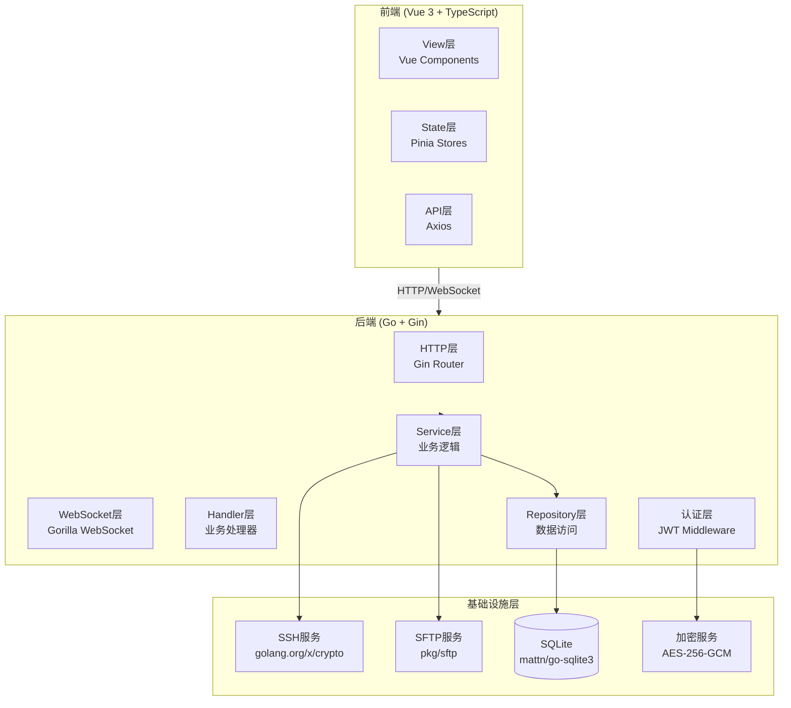
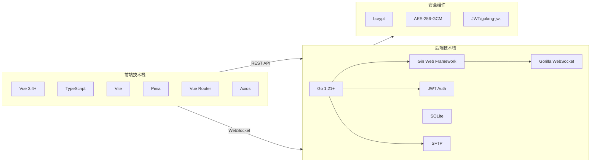
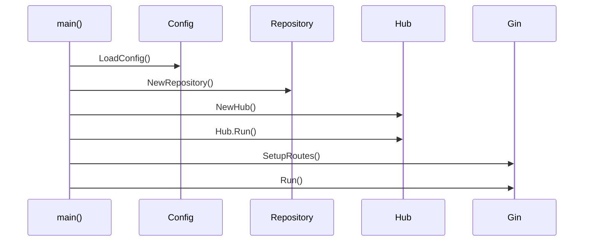
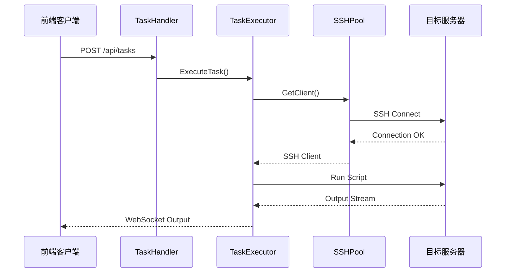
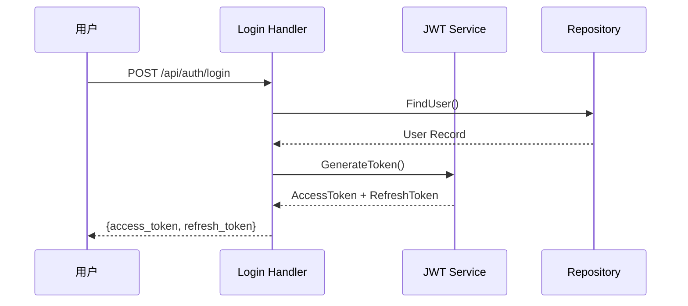
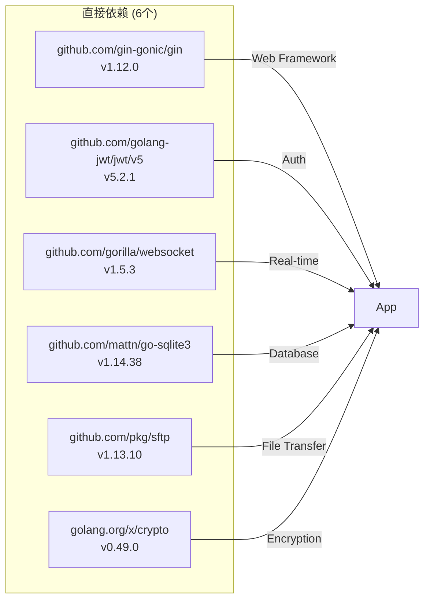
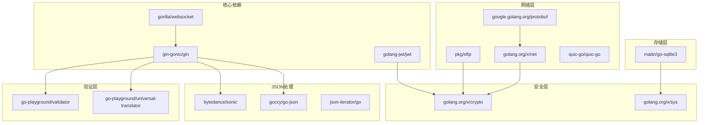
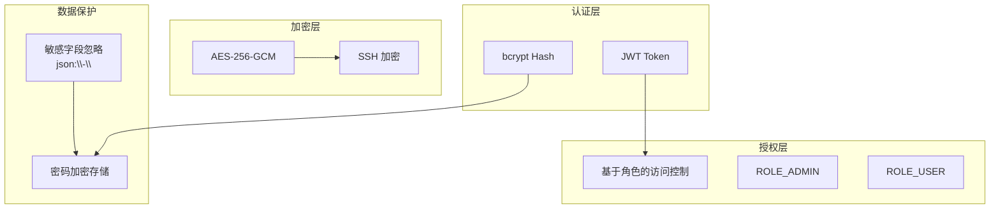

# NodePilot 项目模块文档

## 项目概述

| 属性 | 值 |
|------|-----|
| 项目名称 | NodePilot |
| 模块路径 | node-pilot |
| 编程语言 | Go + TypeScript/Vue3 |
| 仓库路径 | /mnt/e/project/opencode-project/goProject/src/test-dev/node-pilot |
| GitNexus索引 | ✅ 已索引 (14674 symbols, 39197 relationships, 300 processes) |

> 🚀 批量服务器管理平台 - 一键部署、批量操作、实时监控

---

## 项目架构图



---

## 技术栈全景图



---

## 项目结构

```
node-pilot/
├── backend/
│   ├── cmd/server/
│   │   └── main.go                    # 程序入口
│   ├── internal/
│   │   ├── auth/
│   │   │   └── jwt.go                  # JWT 工具
│   │   ├── config/
│   │   │   └── config.go               # 配置管理
│   │   ├── handler/
│   │   │   ├── auth.go                 # 认证处理器
│   │   │   ├── fileupload.go           # 文件上传处理器
│   │   │   ├── handler.go              # 通用处理器
│   │   │   └── user.go                 # 用户管理处理器
│   │   ├── logger/
│   │   │   └── logger.go               # 日志管理
│   │   ├── middleware/
│   │   │   └── auth.go                 # JWT 认证中间件
│   │   ├── model/
│   │   │   └── model.go                # 数据模型
│   │   ├── repository/
│   │   │   └── db.go                   # 数据库访问
│   │   ├── service/
│   │   │   ├── fileupload.go           # 文件上传服务
│   │   │   ├── ssh.go                  # SSH 连接池
│   │   │   └── task.go                 # 任务执行器
│   │   └── websocket/
│   │       └── hub.go                  # WebSocket Hub
│   └── web/                            # 嵌入式前端资源
├── frontend/
│   └── src/
│       ├── api/
│       │   └── index.ts                # API 封装
│       ├── components/
│       │   ├── NavBar.vue              # 导航栏
│       │   ├── OutputPanel.vue          # 输出面板
│       │   └── Pagination.vue           # 分页组件
│       ├── router/
│       │   ├── auth-guard.ts            # 路由守卫
│       │   └── index.ts                 # 路由配置
│       ├── stores/
│       │   ├── auth.ts                  # 认证状态
│       │   ├── fileupload.ts            # 文件上传状态
│       │   ├── script.ts                # 脚本状态
│       │   ├── server.ts                # 服务器状态
│       │   └── task.ts                  # 任务状态
│       ├── types/
│       │   └── index.ts                 # TypeScript 类型
│       ├── views/
│       │   ├── FileForm.vue             # 文件表单
│       │   ├── FileList.vue             # 文件列表
│       │   ├── Login.vue                # 登录页
│       │   ├── Profile.vue              # 个人资料
│       │   ├── ScriptForm.vue           # 脚本表单
│       │   ├── ScriptList.vue           # 脚本列表
│       │   ├── ServerForm.vue           # 服务器表单
│       │   ├── ServerList.vue           # 服务器列表
│       │   ├── TaskForm.vue             # 任务表单
│       │   ├── TaskList.vue             # 任务列表
│       │   ├── TaskOutput.vue           # 任务输出
│       │   └── UserList.vue             # 用户列表
│       ├── App.vue
│       └── main.ts
├── docs/
│   └── modules/
│       └── node-pilot.md               # 本文档
├── scripts/
│   └── start.sh                        # 启动脚本
└── data/
    └── servers.db                      # SQLite 数据库
```

---

## 核心模块说明

### Handler 模块

| 结构体 | 文件路径 | 说明 |
|--------|----------|------|
| `AuthHandler` | backend/internal/handler/auth.go | 认证处理器 |
| `Handler` | backend/internal/handler/handler.go | 通用处理器 |
| `UserHandler` | backend/internal/handler/user.go | 用户管理处理器 |
| `FileUploadHandler` | backend/internal/handler/fileupload.go | 文件上传处理器 |

### Service 模块

| 结构体 | 文件路径 | 说明 |
|--------|----------|------|
| `SSHPool` | backend/internal/service/ssh.go | SSH 连接池 |
| `TaskExecutor` | backend/internal/service/task.go | 任务执行器 |
| `FileUploadService` | backend/internal/service/fileupload.go | 文件上传服务 |

### Repository 模块

| 结构体 | 文件路径 | 说明 |
|--------|----------|------|
| `Repository` | backend/internal/repository/db.go | 数据库访问层 |

### WebSocket 模块

| 结构体 | 文件路径 | 说明 |
|--------|----------|------|
| `Hub` | backend/internal/websocket/hub.go | WebSocket 中心 hub |
| `Client` | backend/internal/websocket/hub.go | WebSocket 客户端 |

---

## 数据结构

| 结构体 | 文件路径 | 说明 |
|--------|----------|------|
| `Server` | backend/internal/model/model.go | 服务器模型 |
| `Script` | backend/internal/model/model.go | 脚本模型 |
| `Task` | backend/internal/model/model.go | 任务模型 |
| `User` | backend/internal/model/model.go | 用户模型 |
| `FileUpload` | backend/internal/model/model.go | 文件上传模型 |
| `WSMessage` | backend/internal/model/model.go | WebSocket 消息 |
| `Claims` | backend/internal/auth/jwt.go | JWT Claims |
| `Config` | backend/internal/config/config.go | 配置结构 |

---

## 关键执行流程

### main() 启动流程



### 任务执行流程



### 用户认证流程



---

## 外部依赖库

### 直接依赖 (Required)



| 依赖库 | 版本 | 用途 | 许可 |
|--------|------|------|------|
| `github.com/gin-gonic/gin` | v1.12.0 | 高性能 HTTP Web 框架 | MIT |
| `github.com/golang-jwt/jwt/v5` | v5.2.1 | JWT 实现 | BSD-3-Clause |
| `github.com/gorilla/websocket` | v1.5.3 | WebSocket 实现 | BSD-2-Clause |
| `github.com/mattn/go-sqlite3` | v1.14.38 | SQLite 数据库驱动 | BSD-3-Clause |
| `github.com/pkg/sftp` | v1.13.10 | SFTP 客户端实现 | BSD-2-Clause |
| `golang.org/x/crypto` | v0.49.0 | SSH 和加密库 | BSD-3-Clause |

### 间接依赖 (Indirect)

#### Web 框架相关

| 依赖库 | 版本 | 说明 |
|--------|------|------|
| `github.com/bytedance/gopkg` | v0.1.3 | 字节跳动工具库 |
| `github.com/bytedance/sonic` | v1.15.0 | JSON 序列化 |
| `github.com/gin-contrib/sse` | v1.1.0 | Gin SSE 支持 |
| `github.com/goccy/go-json` | v0.10.5 | JSON 编解码 |
| `github.com/json-iterator/go` | v1.1.12 | JSON 迭代器 |
| `github.com/ugorji/go/codec` | v1.3.1 | 多格式编解码 |

#### 验证与国际化

| 依赖库 | 版本 | 说明 |
|--------|------|------|
| `github.com/go-playground/locales` | v0.14.1 | 本地化支持 |
| `github.com/go-playground/universal-translator` | v0.18.1 | 通用翻译器 |
| `github.com/go-playground/validator/v10` | v10.30.1 | 数据验证 |

#### 密码学与安全

| 依赖库 | 版本 | 说明 |
|--------|------|------|
| `golang.org/x/crypto` | v0.49.0 | 密码学原语 |
| `golang.org/x/sys` | v0.42.0 | 系统调用 |
| `golang.org/x/text` | v0.35.0 | 文本处理 |
| `golang.org/x/arch` | v0.22.0 | CPU 架构支持 |

#### 网络相关

| 依赖库 | 版本 | 说明 |
|--------|------|------|
| `golang.org/x/net` | v0.51.0 | 网络协议 |
| `google.golang.org/protobuf` | v1.36.10 | Protocol Buffers |
| `github.com/quic-go/quic-go` | v0.59.0 | QUIC 协议实现 |
| `github.com/klauspost/cpuid/v2` | v2.3.0 | CORS 头处理 |

#### 云原生相关

| 依赖库 | 版本 | 说明 |
|--------|------|------|
| `go.mongodb.org/mongo-driver/v2` | v2.5.0 | MongoDB 驱动 |

#### 其他工具

| 依赖库 | 版本 | 说明 |
|--------|------|------|
| `github.com/gabriel-vasile/mimetype` | v1.4.12 | MIME 类型检测 |
| `github.com/goccy/go-yaml` | v1.19.2 | YAML 解析 |
| `github.com/leodido/go-urn` | v1.4.0 | URN 解析 |
| `github.com/mattn/go-isatty` | v0.0.20 | 终端检测 |
| `github.com/modern-go/concurrent` | v0.0.0 | 并发工具 |
| `github.com/modern-go/reflect2` | v1.0.2 | 反射增强 |
| `github.com/pelletier/go-toml/v2` | v2.2.4 | TOML 解析 |
| `github.com/twitchyliquid64/golang-asm` | v0.15.1 | 原子操作 |
| `github.com/kr/fs` | v0.1.0 | 文件系统工具 |
| `github.com/cloudwego/base64x` | v0.1.6 | Base64 编解码 |

---

## 依赖关系图谱



---

## GitNexus 查询提示

### 按模块查询

| 模块 | 查询命令 |
|------|----------|
| **Handler模块** | `gitnexus_query("Handler处理器 认证", repo="node-pilot")` |
| **Service模块** | `gitnexus_query("Service服务 SSH连接池", repo="node-pilot")` |
| **Repository模块** | `gitnexus_query("Repository数据库访问", repo="node-pilot")` |
| **WebSocket模块** | `gitnexus_query("WebSocket Hub实时通信", repo="node-pilot")` |
| **Auth模块** | `gitnexus_query("Auth认证 JWT中间件", repo="node-pilot")` |

### 按结构体查询

直接使用以下函数名进行精确查询：

```bash
# 查找 Handler 结构
gitnexus_context(name="Handler", repo="node-pilot")
gitnexus_context(name="AuthHandler", repo="node-pilot")

# 查找 Service 结构
gitnexus_context(name="SSHPool", repo="node-pilot")
gitnexus_context(name="TaskExecutor", repo="node-pilot")
gitnexus_context(name="FileUploadService", repo="node-pilot")

# 查找 Model
gitnexus_context(name="Server", repo="node-pilot")
gitnexus_context(name="Script", repo="node-pilot")
gitnexus_context(name="Task", repo="node-pilot")
gitnexus_context(name="User", repo="node-pilot")

# 查找认证相关
gitnexus_context(name="Claims", repo="node-pilot")
gitnexus_context(name="Config", repo="node-pilot")
```

### 完整调用链查询

```bash
# main 函数调用链
gitnexus_cypher("MATCH (f:Function {name: 'main'})-[:CALLS]->(g) RETURN g.name", repo="node-pilot")

# Handler 调用链
gitnexus_cypher("MATCH (f:Function {name: 'Handler'})-[:CALLS]->(g) RETURN g.name", repo="node-pilot")

# TaskExecutor 执行链
gitnexus_cypher("MATCH (f:Function {name: 'TaskExecutor'})-[:CALLS]->(g) RETURN g.name", repo="node-pilot")
```

### 执行流程查询

```bash
# 查询所有已索引的流程
gitnexus_cypher("MATCH (p:Process) RETURN p.heuristicLabel", repo="node-pilot")

# 查询特定流程
gitnexus_query("用户登录认证流程", repo="node-pilot")
gitnexus_query("任务执行流程", repo="node-pilot")
```

---

## 核心函数列表

### Handler 层

| 函数名 | 文件路径 | 功能 |
|--------|----------|------|
| `AuthHandler.Login` | backend/internal/handler/auth.go | 用户登录 |
| `AuthHandler.Refresh` | backend/internal/handler/auth.go | 刷新Token |
| `AuthHandler.Me` | backend/internal/handler/auth.go | 获取当前用户 |
| `UserHandler.Create` | backend/internal/handler/user.go | 创建用户 |
| `UserHandler.Delete` | backend/internal/handler/user.go | 删除用户 |
| `Handler.CreateServer` | backend/internal/handler/handler.go | 创建服务器 |
| `Handler.CreateScript` | backend/internal/handler/handler.go | 创建脚本 |
| `Handler.CreateTask` | backend/internal/handler/handler.go | 创建任务 |
| `FileUploadHandler.Upload` | backend/internal/handler/fileupload.go | 文件上传 |

### Service 层

| 函数名 | 文件路径 | 功能 |
|--------|----------|------|
| `NewSSHPool` | backend/internal/service/ssh.go | 创建SSH连接池 |
| `SSHPool.GetClient` | backend/internal/service/ssh.go | 获取SSH客户端 |
| `SSHPool.Close` | backend/internal/service/ssh.go | 关闭连接池 |
| `NewTaskExecutor` | backend/internal/service/task.go | 创建任务执行器 |
| `TaskExecutor.Execute` | backend/internal/service/task.go | 执行任务 |
| `TaskExecutor.Cancel` | backend/internal/service/task.go | 取消任务 |

### WebSocket 层

| 函数名 | 文件路径 | 功能 |
|--------|----------|------|
| `NewHub` | backend/internal/websocket/hub.go | 创建Hub |
| `Hub.Run` | backend/internal/websocket/hub.go | 运行Hub |
| `Hub.Register` | backend/internal/websocket/hub.go | 注册客户端 |
| `Hub.Unregister` | backend/internal/websocket/hub.go | 注销客户端 |
| `Hub.Broadcast` | backend/internal/websocket/hub.go | 广播消息 |

---

## 安全架构



### 安全措施

| 安全措施 | 实现 | 说明 |
|----------|------|------|
| JWT认证 | `github.com/golang-jwt/jwt/v5` | Access Token (24h) + Refresh Token (7天) |
| 密码哈希 | `golang.org/x/crypto/bcrypt` | 用户密码安全存储 |
| 敏感字段保护 | `json:"-"` tag | 不暴露敏感字段 |
| SSH密码加密 | AES-256-GCM | 密码加密存储 |
| 路由守卫 | auth-guard.ts | 前端路由权限控制 |

---

## 快速开发查询

### 需要修改认证逻辑？

```bash
# 1. 查看认证处理器
gitnexus_context(name="AuthHandler", repo="node-pilot")

# 2. 查看JWT服务
gitnexus_context(name="Claims", repo="node-pilot")

# 3. 查看中间件
gitnexus_context(name="Auth", repo="node-pilot")
```

### 需要修改任务执行？

```bash
# 1. 查看任务执行器
gitnexus_context(name="TaskExecutor", repo="node-pilot")

# 2. 查看SSH连接池
gitnexus_context(name="SSHPool", repo="node-pilot")

# 3. 查看WebSocket hub
gitnexus_context(name="Hub", repo="node-pilot")
```

### 需要添加新API？

```bash
# 1. 查看现有Handler模式
gitnexus_context(name="Handler", repo="node-pilot")

# 2. 查看路由注册
gitnexus_query("路由注册 Gin", repo="node-pilot")
```

---

## 总结

NodePilot 是一个功能完整的批量服务器管理平台，采用现代化的技术栈：

- **前端**: Vue 3 + TypeScript + Pinia + Vite
- **后端**: Go + Gin + SQLite + WebSocket
- **安全**: JWT + bcrypt + AES-256-GCM
- **远程操作**: SSH + SFTP

依赖关系清晰，模块划分明确，便于维护和扩展。

---

*文档生成时间: 2026-04-07*
*基于 GitNexus 知识图谱自动生成*
